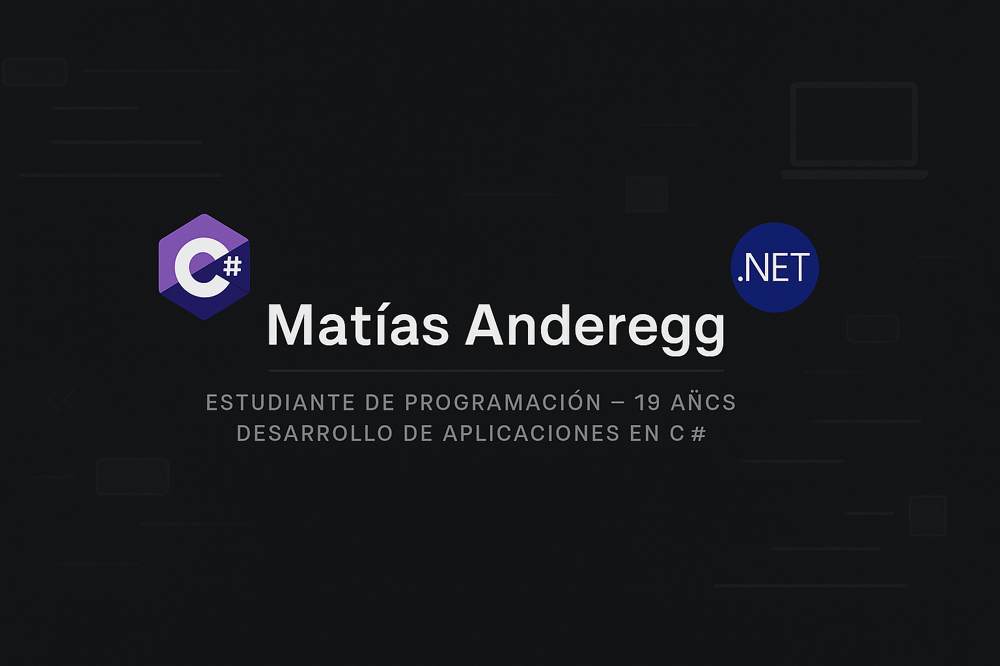

# 👋 ¡Hola! Soy Matías Anderegg

---

## ✨ Sobre mí

Soy **Matías Anderegg**, un estudiante de programación de **19 años** con muchas ganas de aprender, experimentar y crecer en el mundo del desarrollo de software.  
Este perfil de GitHub es donde subo mis **proyectos relacionados con las materias que curso** y también ideas personales que me ayudan a mejorar mis habilidades.

🛠️ Me gusta trabajar en proyectos prácticos como:
- Aplicaciones de consola con **C# y .NET**
- Sistemas con **base de datos SQLite**
- Interfaces en terminal usando **Spectre.Console** y **Terminal.Gui**
- Reportes, CRUD, facturación y más...

---

## 📫 Contacto

---

## 🌱 Actualmente estoy aprendiendo

- Fundamentos sólidos de programación
- Desarrollo con **C# y .NET**
- Manejo de bases de datos con **SQLite**
- Arquitectura de software y organización de proyectos
- Aplicaciones de consola con interfaces visuales

---

## 📊 GitHub Stats

---

Gracias por visitar mi perfil 🤝  
¡Se vienen muchos proyectos más!

